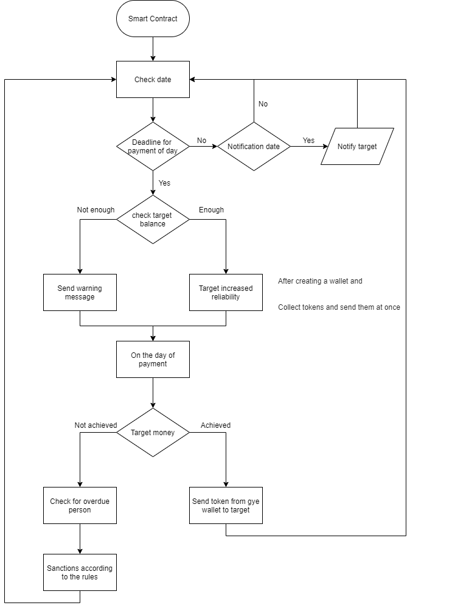

# Armagyeddon 
Armagyeddon is blockchain-based traditional Korean cooperative organization platform 

# Installation

1. Install java  
`sudo apt install openjdk-11-jre-headless`

2. Install maven  
`sudo apt-get install maven`  

3. Clone this repository  
`git clone https://github.com/wjrmffldrhrl/armagyeddon-backend.git`

4. Run Spring boot with maven  
`mvn spring-boot:run`  

# Usage

# Related repository
- [Front-end](https://github.com/wjrmffldrhrl/armagyeddon-frontend)
- [Contract](https://github.com/wjrmffldrhrl/armagyeddon-contract)
